Đề tài 4: Phân loại chủ đề bài báo
# Nguyễn Đình Huy - 1771020357
# Các tính năng:
    + 1. Chuẩn bị dữ liệu thô để xử lý
    + 2. Làm sạch dữ liệu và tạo nhãn cho phân loại
    + 3. chuyển văn bản thành dạng số để các mô hình ML hiểu được.
    + 4. chuẩn bị dữ liệu cho huấn luyện và đánh giá.
    + 5. xây dựng bộ phân loại chủ đề dựa trên văn bản abstract.
    + 6. phân tích hiệu quả mô hình, nhận diện nhãn khó phân loại.
# Kết quả thu được:
  Bước 1: Khám phá dữ liệu

  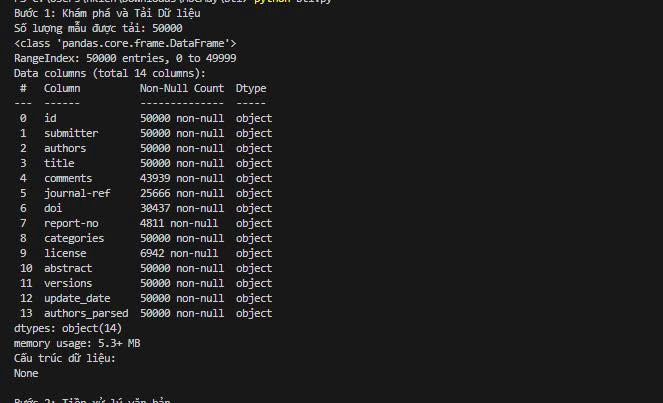

  Bước 2: Tiền xử lý văn bản

  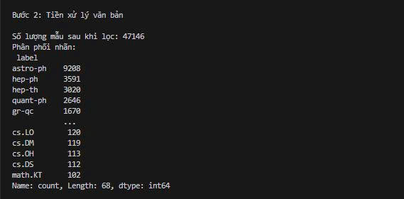

  Bước 3: Vector hoá văn bản

  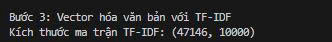

  Bước 4: Huấn luyện bằng các mô hình khác nhau

  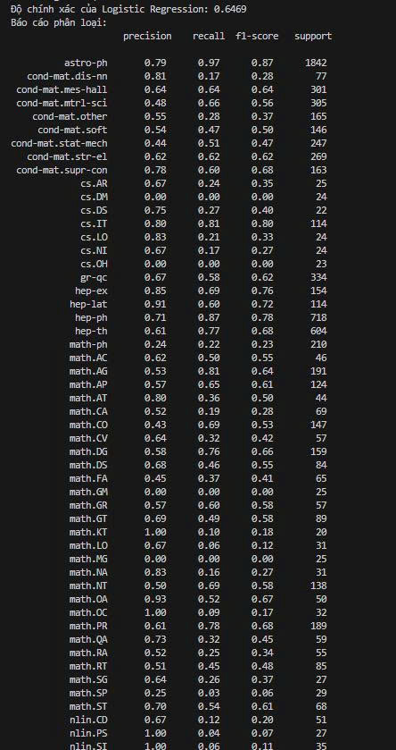

  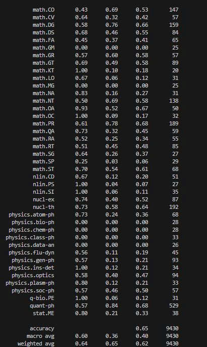

  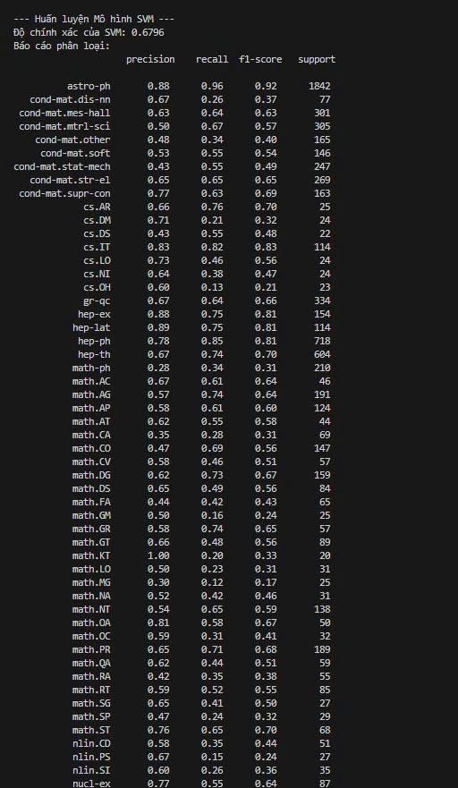

  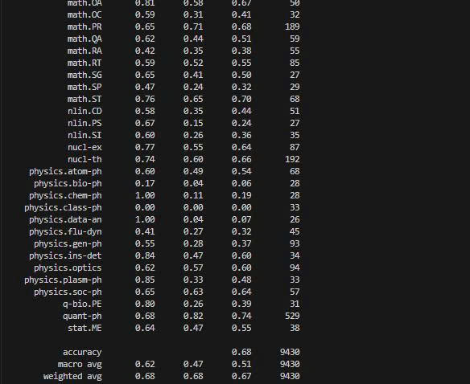

  Bước 5: Phân tích và đánh giá mô hình

  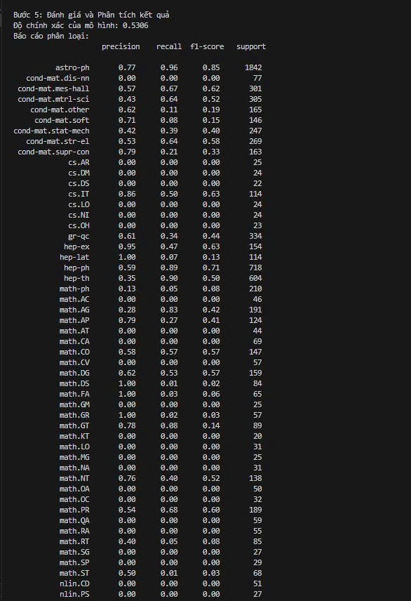

  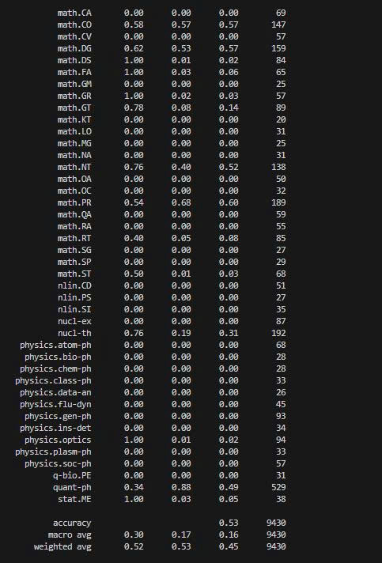

  So sánh mô hình

  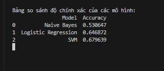

  So sánh độ chính xác

  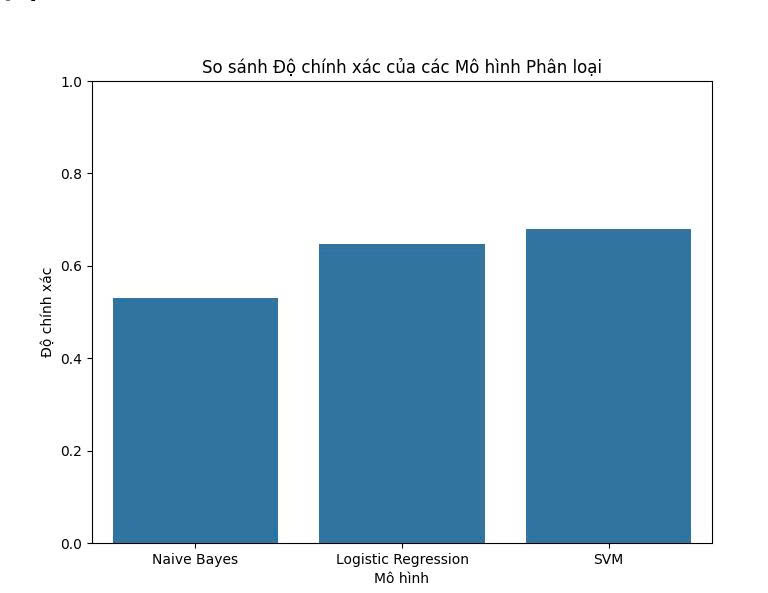

